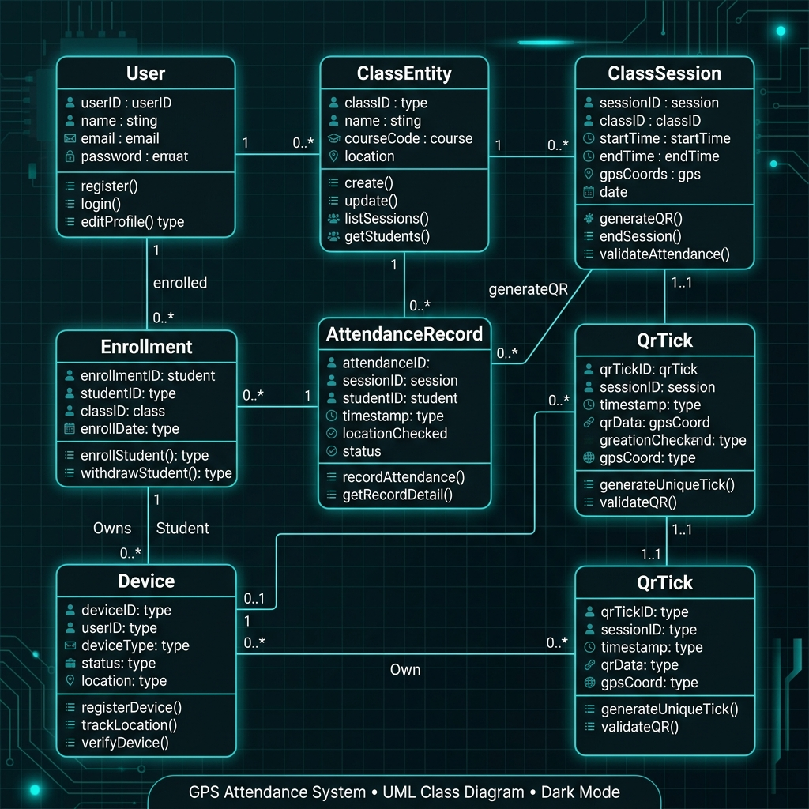
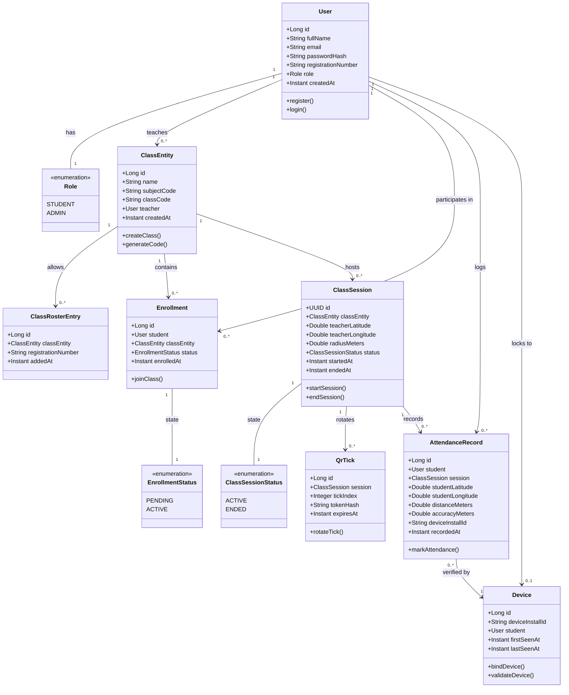

# 📍 SWE Attendance System

A GPS Geofenced, Cryptographically Verified, Anti-Proxy Attendance Management Platform.

---

## 👥 Contributors

* **MD Fahim Ahammad Tanvir** - `2023831018`
* **Faria Mahmood** - `2023831026`
* **Pranta Chowdhury** - `2023831058`

---

## 🛑 The Problems It Solves

Traditional paper sheet attendance and basic static QR code attendance methods suffer from severe security and efficiency limitations:

1. **Proxy Attendance (Buddy Punching)**: Students in physical classrooms frequently sign for absent peers or use multiple accounts on a single phone to log attendance for friends.
2. **QR Code Screenshot Sharing / Replay Attacks**: When static or slowly updating QR codes are projected on a screen, students take a photo or screenshot, instantly message it over WhatsApp/Telegram to students outside the classroom, and mark attendance remotely.
3. **Location Spoofing & GPS Replay**: Basic location checks can be bypassed using mock location apps or stale GPS coordinates cached on mobile devices.
4. **Manual Overhead & Slow Processing**: Calling roll-call lists manually consumes valuable lecture time and creates human logging errors.

---

## 💡 How It Solves These Problems

The **SWE Attendance System** eliminates proxies through a multi-tier defense architecture combining **GPS Geofencing**, **Hardware Device Binding**, **Signal Calibration**, and **Dynamic HMAC-SHA256 Token Rotation**:

1. **Geodesic Haversine Geofencing**: When a teacher initiates an attendance session, the system captures their high-precision GPS coordinates (`latitude`, `longitude`) and creates a geofence zone with a teacher-selected radius (e.g., 5m, 10m, 20m, 50m). Student coordinates are validated mathematically using the **Haversine formula**.
2. **Calibrated GPS Confidence Check**: The system validates that `student_distance + gps_accuracy <= classroom_radius`. If a student's reading has poor GPS accuracy (high margin of error) that extends beyond the boundary, it is automatically rejected to guarantee physical presence.
3. **GPS Coordinate Freshness (Anti-Spoof)**: Coordinate capture timestamps from the client must be within **15 seconds** of the server request time. Replayed, cached, or stale mock coordinates are immediately rejected.
4. **Hardware Device Locking (Anti-Proxy)**: On login, registration, and attendance submission, the system binds a persistent client `deviceInstallId` to the student's profile in the `devices` table. If another student attempts to claim attendance or log in using the same device, the backend immediately rejects the request with a `409 CONFLICT` status.
5. **Dynamic 1-Second AES-GCM & HMAC-SHA256 Rotation**: Sessions stream short-lived QR tokens over WebSockets (`/ws`) rotated every 1 second. Each token is encrypted using AES-GCM and signed with a backend HMAC secret. Screenshots become invalid within 1 second, defeating remote sharing.

---

## 📐 Class Diagram

The following diagram illustrates the core entity models, attributes, methods, and relationships powering the system:



---

## 🔗 UML Diagram: Class Connections & Architecture

The entity-relationship structure and class associations are modeled below:



---

## 🔄 Task Workflows & Process Lifecycles

### 1. Account Creation (Registration)
1. User provides Full Name, Email, Password, Role (`STUDENT` or `ADMIN`/Teacher), and Student Registration Number (if student).
2. The client generates and includes a unique hardware `deviceInstallId`.
3. Backend checks:
   - Email uniqueness in `users` table.
   - Registration Number uniqueness for students.
   - Device uniqueness: Ensures the `deviceInstallId` is not already bound to another registered student.
4. Passwords are securely hashed with **BCrypt**.
5. The device is bound to the new user account in the `devices` table, and a signed **JWT authentication token** is returned.

### 2. User Login
1. User enters Email and Password along with their `deviceInstallId`.
2. Backend validates credentials using `AppUserDetailsService` and `BCryptPasswordEncoder`.
3. If the user is a `STUDENT`, the backend validates that the `deviceInstallId` matches their previously registered device. If another student's account is already linked to that device, login is rejected (`409 CONFLICT`).
4. On success, a stateless JWT token (valid for 24 hours) is generated containing User ID, Email, Role, and Registration Number.

### 3. Joining a Class
1. A Teacher creates a class with a Subject Name and Code; the backend generates a unique 6-character alphanumeric `classCode`.
2. Teacher optionally uploads an allowlisted CSV roster containing student registration numbers.
3. A Student searches for the class using the 6-character `classCode`.
4. Backend checks:
   - If a class roster exists, the student's registration number must be present in `class_roster`.
   - Ensures the student is not already enrolled.
5. An `Enrollment` record is created with `ACTIVE` status.

### 4. Starting an Attendance Session
1. The Teacher opens the class dashboard and selects the desired classroom geofence radius (e.g., 5m, 10m, 20m, 50m, 100m).
2. The Teacher's device runs a high-accuracy GPS calibration loop to lock exact Teacher coordinates (`latitude`, `longitude`).
3. Backend creates a `ClassSession` record with `ACTIVE` status and starts the `SessionEngine` ticker.
4. The backend schedules dynamic HMAC-SHA256 ticks every second, broadcasting real-time session state over WebSockets (`/topic/sessions/{sessionId}/ticks`).
5. The session auto-terminates after **150 seconds** or when manually closed by the teacher.

### 5. Recording & Claiming Attendance
1. The Student navigates to the active class session on their web or mobile application.
2. The Student taps **"Give Attendance (GPS)"**.
3. The Student's device captures real-time high-accuracy GPS coordinates (`latitude`, `longitude`, `accuracyMeters`, `timestamp`).
4. The request payload is sent to `POST /api/attendance/claim` with the student's JWT and `deviceInstallId`.
5. Backend runs atomic validation checks:
   - **Session Status**: Must be currently `ACTIVE`.
   - **Roster & Enrollment**: Student must belong to the class roster and enrollment.
   - **Duplicate Claim**: Rejects if attendance has already been recorded for this session.
   - **Device Lock**: Verifies the `deviceInstallId` matches the authenticated student.
   - **GPS Freshness**: Ensures coordinate capture timestamp is less than **15 seconds** old.
   - **Haversine Distance**: Calculates geodesic distance $d$ between student and teacher coordinates.
   - **Calibrated Accuracy**: Checks $d + \text{accuracy} \le \text{radius}$.
6. If valid, an `AttendanceRecord` is created, and the teacher's live dashboard updates instantly via WebSockets.

---

## 🏗️ System Structure & Technology Stack

```
attendanceSystem/
├── flutter_app/                        # Flutter Native Mobile Application
│   ├── lib/
│   │   ├── models/                     # User, Class, Session, Attendance models
│   │   ├── providers/                  # AuthProvider (State management)
│   │   ├── screens/                    # Login, TeacherDashboard, StudentDashboard
│   │   ├── services/                   # ApiService, LocationService (GPS Geolocator)
│   │   ├── widgets/                    # Location radar, Radius slider
│   │   └── main.dart                   # Application entry point & theme
│   └── pubspec.yaml                    # Flutter dependencies
│
├── frontend/                           # React 19 + Vite + Capacitor Web & Android App
│   ├── android/                        # Native Android Wrapper (Capacitor)
│   │   └── app/src/main/res/           # Custom launcher mipmaps & adaptive icons
│   ├── src/
│   │   ├── components/                 # AttendanceTable, ScannerPanel, SessionPanel, Layout
│   │   ├── lib/                        # api.js, AuthContext, location.js, deviceId.js
│   │   ├── pages/                      # AuthPage, TeacherDashboard, StudentDashboard
│   │   ├── App.jsx                     # Route definitions
│   │   └── index.css                   # Glassmorphism & responsive CSS styling
│   ├── capacitor.config.json           # Native packaging configuration
│   └── package.json                    # Frontend dependencies
│
├── src/main/java/com/jarvisatt/attendance/ # Spring Boot 3 Backend
│   ├── config/                         # SecurityConfig, WebSocketConfig, SchedulerConfig
│   ├── controller/                     # Auth, Class, Session, Attendance, Roster controllers
│   ├── crypto/                         # AesPayloadCipher, HmacTokenService
│   ├── domain/                         # JPA Database Entities
│   ├── dto/                            # Request & Response Records
│   ├── repository/                     # Spring Data JPA Repositories
│   ├── security/                       # JwtAuthenticationFilter, JwtService
│   ├── service/                        # AuthService, AttendanceService, SessionLifecycleService
│   └── session/                        # SessionEngine (Dynamic tick rotation & WebSocket push)
│
├── src/main/resources/
│   ├── db/migration/                   # Flyway Schema Migrations (V1, V2, V3)
│   └── application.yml                 # Database, JWT & server configuration
│
├── docs/
│   ├── diagrams/                       # DFD, ERD, Sequence, and Class diagrams
│   ├── backend_guide.md                # Comprehensive backend guide
│   ├── frontend_guide.md               # Frontend & mobile guide
│   └── system_structure.md             # Complete file index & reference
│
├── docker-compose.yml                  # Local PostgreSQL 16 container setup
├── Dockerfile                          # Multi-stage production container build
└── pom.xml                             # Maven backend dependencies
```

### Technology Stack Summary

| Layer | Technologies |
| :--- | :--- |
| **Backend** | Java 21, Spring Boot 3.3.8, Spring Security, Spring Data JPA, Spring WebSockets (STOMP), Flyway, Lombok |
| **Database** | PostgreSQL 16 |
| **Frontend Web** | React 19, Vite, Lucide Icons, Vanilla CSS Glassmorphism |
| **Mobile Web Wrapper** | Capacitor 8 (Native Android APK build) |
| **Native Mobile App** | Flutter 3.x, Dart, Geolocator, Provider, Google Fonts (Inter) |
| **Security & Math** | BCrypt, JWT (HMAC-SHA256), AES-GCM (128-bit tag), Haversine Geodesic Distance Engine |

---

## 🔑 Pre-Configured Test Credentials

| Account Type | Email | Password | Role | Registration No |
| :--- | :--- | :--- | :--- | :--- |
| **Teacher** | `teacher@example.com` | `password` | Teacher (`ADMIN`) | N/A |
| **Student** | `ch.wixard@student.sust.edu` | `password` | Student (`STUDENT`) | `2023831001` |

---

## 🚀 Installation & How to Run

### Prerequisites
* **Java Development Kit (JDK) 21+**
* **Node.js 20+** and **npm**
* **Docker & Docker Compose** (or a local PostgreSQL 16 instance)
* *(Optional for Flutter)* **Flutter SDK 3.0+**

---

### Step 1: Start the PostgreSQL Database

Using Docker Compose:
```bash
docker-compose up -d
```
*This launches PostgreSQL 16 on port `5432` with database `jarvis_att`, user `jarvis`, and password `jarvis`.*

---

### Step 2: Run the Spring Boot Backend

On Windows:
```powershell
.\mvnw.cmd spring-boot:run
```

On macOS / Linux:
```bash
./mvnw spring-boot:run
```
*The backend API will start at `http://localhost:8080` and execute Flyway migrations automatically.*

---

### Step 3: Run the React Web Application

```bash
cd frontend
npm install
npm run dev
```
*The web frontend will run at `http://localhost:5173`.*

---

### Step 4: Run the Flutter Mobile App (Optional)

```bash
cd flutter_app
flutter pub get
flutter run
```