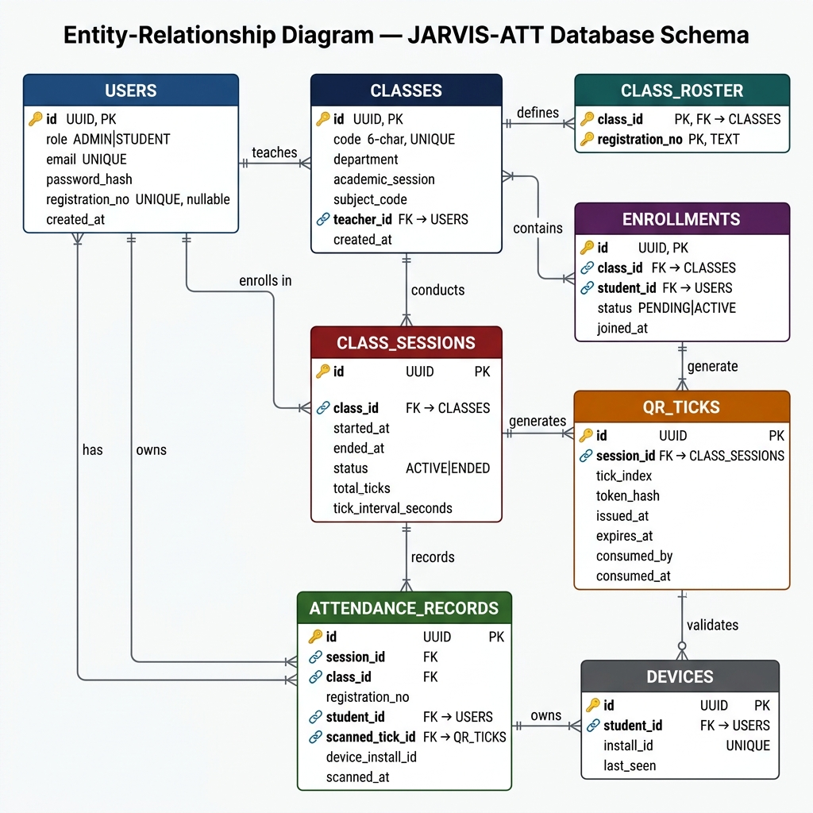
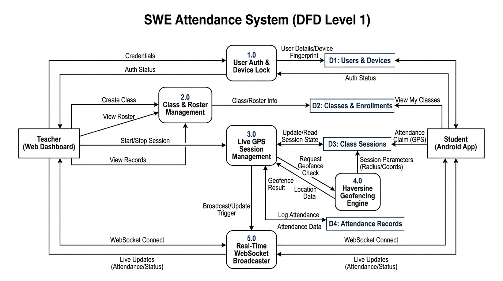
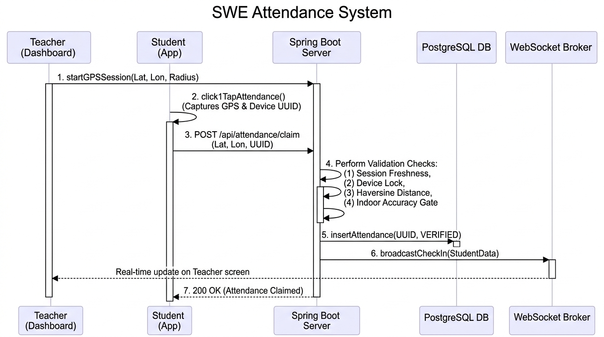
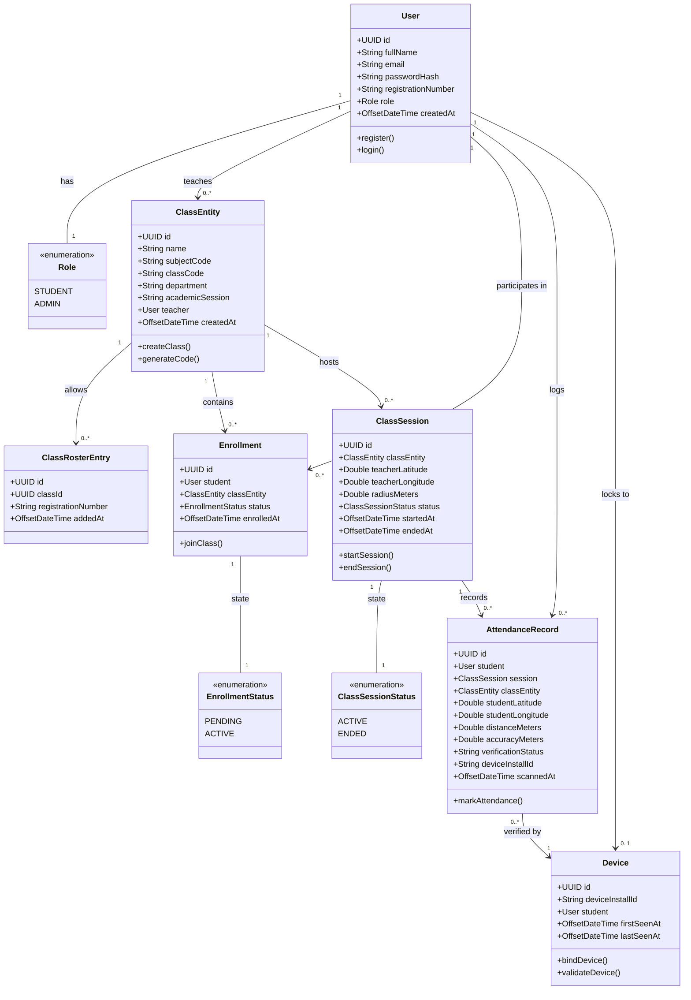

# 📍 SWE Attendance System

An Enterprise-Grade, GPS-Geofenced, Anti-Proxy Attendance Management Platform for Universities.

---

## 👥 Contributors

* **MD Fahim Ahammad Tanvir** - `2023831018`
* **Faria Mahmood** - `2023831026`
* **Pranta Chowdhury** - `2023831058`

---

## 🛑 The Problems It Solves

Traditional paper sheet attendance and manual roll-call methods suffer from severe security and efficiency limitations:

1. **Proxy Attendance (Buddy Punching)**: Students in physical classrooms frequently sign for absent peers or use multiple accounts on a single phone to log attendance for friends.
2. **Location Spoofing & GPS Replay**: Basic location checks can be bypassed using mock location apps, stale GPS coordinates cached on mobile devices, or remote VPN connections.
3. **Indoor Satellite Drift & False Rejections**: Standard GPS indoors suffers from multi-path signal reflection off concrete walls, often causing legitimate students sitting in corner seats or back rows to be falsely rejected.
4. **Manual Overhead & Reconciliation Friction**: Calling roll-call lists manually consumes 15–20 minutes of lecture time, and managing attendance percentages across multiple sessions creates human logging errors.

---

## 💡 How It Solves These Problems

The **SWE Attendance System** eliminates proxies through a multi-tier defense architecture combining **Geodesic GPS Geofencing**, **Indoor Signal Calibration**, **Hardware Device Binding**, and **Real-Time WebSocket Feedback**:

1. **Geodesic Haversine Geofencing**: When a teacher initiates an attendance session, the system captures their high-precision GPS coordinates (`latitude`, `longitude`) and creates a geofence zone with a teacher-selected radius (e.g., 5m, 10m, 15m, 20m, 50m, 100m). Student coordinates are validated mathematically using the **Haversine formula**.
2. **Calibrated Indoor GPS Quality Gate**: The engine applies an adaptive GPS accuracy filter:
   $$\text{Allowed Accuracy Ceiling} = \min(40.0\text{m}, \text{Radius} \times 2.0)$$
   $$\text{Haversine Distance } d \le \text{Classroom Radius}$$
   This ensures boundary students with minor indoor satellite drift are not falsely rejected while blocking spoofed or weak cell-tower signals ($>40\text{m}$).
3. **GPS Coordinate Freshness (Anti-Spoof)**: Coordinate capture timestamps from the client must be within **60 seconds** of server validation time. Replayed, cached, or stale mock coordinates are immediately rejected.
4. **Hardware Device Locking (Anti-Proxy)**: On login, registration, and attendance submission, the system binds a persistent client `deviceInstallId` to the student's profile in the `devices` table. If another student attempts to claim attendance or log in using the same device, the backend immediately rejects the request with a `409 CONFLICT` status. Teachers can reset a device binding if a student genuinely changes phones.
5. **Seamless Roster & Auto-Enrollment Sync**: Teachers can upload student registration rosters or permit direct code-based joining (`SWE0613-xxxx`). The system automatically synchronizes enrollments and rosters on valid attendance claims.

---

## 🖼️ System Architecture & Visual Diagrams

### 1. Class Diagram
The core entity models, attributes, methods, and relationships powering the system:


---

### 2. Entity Relationship Diagram (Database Schema)
The complete PostgreSQL relational schema, constraints, foreign keys, and indexes:



---

### 3. Data Flow Diagram (DFD)
How data propagates from clients through security filters, GPS geofencing engines, and persistence layers:



---

### 4. UML Sequence Diagram: Attendance Verification Flow
The end-to-end geodesic validation handshake between Teacher, Student, and Backend:



---

## 🔗 UML Class Connections & Architecture



---

## 🌟 Core Features & Modules

### 👨‍🏫 Teacher / Admin Module
* **Class Management**: Create classes with custom subject codes, names, semester, credits, and unique class codes (e.g. `SWE0613-1121`).
* **Session Lifecycle**: Start live GPS-calibrated sessions with custom radius (5m to 100m), view active session counters, stop sessions on demand, and auto-expire after 150 seconds.
* **Session History & Deletion**: View all conducted sessions (including total present counts) and delete specific sessions with cascading record cleanups.
* **Live GPS Session & WebSocket Feed**: Monitor active sessions with real-time student check-in counters and instant live presence notifications.
* **Student & Roster Management**: Upload CSV / manual registration rosters, inspect enrolled students, delete students from a class, or reset device locks.
* **Attendance Record Analytics & Batch Operations**: View complete student attendance logs, export data, delete individual erroneous records, or perform batch record deletions.

### 🎓 Student Module
* **Direct Class Enrollment**: Join classes using the teacher's class code with instant roster verification.
* **1-Tap GPS Attendance Claim**: Mark attendance instantly using verified geodesic GPS location.
* **Accurate Session History & Attendance Ratio**: View complete session-by-session history for each course and live percentage calculation ($\frac{\text{Attended Sessions}}{\text{Total Sessions Held}} \times 100\%$).
* **Hardware Device Protection**: Secure profile bound to the student's personal smartphone hardware ID.

---

## 🔄 End-to-End Workflows

### 1. Account Registration & Device Binding
1. User provides Full Name, Email, Password, Role (`STUDENT` or `ADMIN`), and Student Registration Number (for students).
2. The client generates and includes a unique hardware `deviceInstallId`.
3. Backend verifies email/registration uniqueness and binds `deviceInstallId` in `devices`. Passwords are encrypted with **BCrypt**.
4. A stateless **JWT token** is returned.

### 2. Joining a Class
1. Teacher creates a class (e.g., Subject `SWE0613`, Code `SWE0613-1121`).
2. Student submits `POST /api/classes/join` with the code.
3. Backend validates eligibility, auto-creates `Enrollment` with `ACTIVE` status, and syncs roster records.

### 3. Starting an Attendance Session
1. Teacher chooses a geofence radius (e.g., 10m) and clicks **Start Session**.
2. Teacher device acquires calibrated GPS coordinates (`teacherLat`, `teacherLon`).
3. Backend initializes `ClassSession` in `ACTIVE` state and opens real-time WebSocket channel (`/topic/attendance/{sessionId}`).

### 4. Claiming Attendance (GPS Geofencing)
1. Student clicks **Give Attendance (GPS)** on their mobile or web application.
2. High-precision GPS is captured on student device (`studentLat`, `studentLon`, `accuracyMeters`, `capturedAt`).
3. Backend validates:
   * **Active Session**: Session is `ACTIVE` and within the 150-second lifecycle.
   * **Capture Freshness**: Reading is within the last 60 seconds.
   * **Haversine Distance**: Computes $d$ between teacher and student.
   * **Accuracy Gate**: Validates $d \le \text{Radius}$ and $\text{Accuracy} \le \min(40\text{m}, \text{Radius} \times 2)$.
   * **Device Lock**: Verifies `deviceInstallId` matches the authenticated student.
   * **Duplicate Claim Check**: Ensures student has not already claimed for this session.
4. An `AttendanceRecord` is stored with status `VERIFIED`, and the teacher's screen updates in real time via WebSockets.

---

## 📡 Complete REST API Reference

### 🔐 Authentication (`/api/auth`)
| Method | Endpoint | Access | Description |
| :--- | :--- | :--- | :--- |
| `POST` | `/api/auth/register` | Public | Register new Teacher or Student account with device binding. |
| `POST` | `/api/auth/login` | Public | Authenticate user; validates device lock & returns JWT. |
| `GET` | `/api/auth/me` | Authenticated | Get current authenticated user profile. |
| `POST` | `/api/auth/reset-password` | Public | Reset password by email or registration number. |
| `DELETE` | `/api/auth/users/{target}` | Admin | Delete a user account (by email or registration number) and cascade records. |

### 🏫 Class Management (`/api/classes`)
| Method | Endpoint | Access | Description |
| :--- | :--- | :--- | :--- |
| `POST` | `/api/classes` | Teacher (`ADMIN`) | Create a new class with subject code and auto-generated class code. |
| `GET` | `/api/classes` | Teacher (`ADMIN`) | List all classes created by the authenticated teacher. |
| `GET` | `/api/classes/enrolled` | Student (`STUDENT`) | List all classes the authenticated student is enrolled in. |
| `POST` | `/api/classes/join` | Student (`STUDENT`) | Join a class using its class code. |
| `POST` | `/api/classes/{classId}/roster` | Teacher (`ADMIN`) | Upload/add student registration numbers to the class roster. |
| `GET` | `/api/classes/{classId}/roster` | Teacher (`ADMIN`) | Get list of all roster entries for a class. |
| `GET` | `/api/classes/{classId}/students` | Teacher (`ADMIN`) | Get all enrolled students with attendance summaries. |
| `DELETE` | `/api/classes/{classId}/students/{regNo}` | Teacher (`ADMIN`) | Remove a student from a class. |

### ⏱️ Session Lifecycle (`/api/sessions`)
| Method | Endpoint | Access | Description |
| :--- | :--- | :--- | :--- |
| `POST` | `/api/sessions/start` | Teacher (`ADMIN`) | Start a new GPS-geofenced attendance session. |
| `POST` | `/api/sessions/{sessionId}/stop` | Teacher (`ADMIN`) | Stop an active session manually. |
| `GET` | `/api/sessions/active?classId={id}` | Authenticated | Get currently active session for a class. |
| `GET` | `/api/sessions/class/{classId}` | Authenticated | List all session history for a class (including empty sessions). |
| `DELETE` | `/api/sessions/{sessionId}` | Teacher (`ADMIN`) | Delete a specific session and its associated attendance records. |

### 📍 Attendance & Verification (`/api/attendance`)
| Method | Endpoint | Access | Description |
| :--- | :--- | :--- | :--- |
| `POST` | `/api/attendance/claim` | Student (`STUDENT`) | Claim attendance via high-accuracy geodesic GPS coordinates. |
| `GET` | `/api/attendance/me` | Student (`STUDENT`) | Get all attendance history for the authenticated student. |
| `GET` | `/api/attendance/classes/{classId}` | Teacher (`ADMIN`) | Get complete attendance records for a class. |
| `GET` | `/api/attendance/classes/{classId}/students/{studentId}` | Teacher (`ADMIN`) | Get attendance records for a specific student in a class. |
| `DELETE` | `/api/attendance/classes/{classId}/students/{studentId}` | Teacher (`ADMIN`) | Delete a student's attendance history in a class. |
| `DELETE` | `/api/attendance/records/{recordId}` | Teacher (`ADMIN`) | Delete a specific attendance record. |
| `POST` | `/api/attendance/records/batch-delete` | Teacher (`ADMIN`) | Batch-delete multiple attendance records by ID list. |
| `POST` | `/api/attendance/students/{studentId}/reset-device` | Teacher (`ADMIN`) | Reset a student's hardware device binding. |
| `WS` | `/topic/attendance/{sessionId}` | Teacher (`ADMIN`) | Real-time STOMP WebSocket channel broadcasting attendance check-ins. |

---

## 🏗️ System Structure & Technology Stack

```
attendanceSystem/
├── flutter_app/                        # Flutter Native Mobile Application
│   ├── lib/
│   │   ├── models/                     # User, Class, Session, Attendance models
│   │   ├── providers/                  # AuthProvider (State management)
│   │   ├── screens/                    # Login, TeacherDashboard, StudentDashboard
│   │   ├── services/                   # ApiService, LocationService (GPS Geolocator)
│   │   ├── widgets/                    # Location radar, Radius slider
│   │   └── main.dart                   # Application entry point & theme
│   └── pubspec.yaml                    # Flutter dependencies
│
├── frontend/                           # React 18/19 + Vite + Capacitor Web & Android App
│   ├── android/                        # Native Android Platform Wrapper (Capacitor)
│   │   └── app/src/main/res/           # Custom launcher mipmaps & adaptive icons
│   ├── src/
│   │   ├── components/                 # AttendanceTable, LocationPanel, SessionPanel, Layout
│   │   ├── lib/                        # api.js, AuthContext, location.js, deviceId.js
│   │   ├── pages/                      # AuthPage, TeacherDashboard, StudentDashboard, DetailPages
│   │   ├── App.jsx                     # Route definitions & guards
│   │   └── index.css                   # Glassmorphism & responsive CSS styling
│   ├── capacitor.config.json           # Native packaging configuration
│   └── package.json                    # Frontend dependencies
│
├── src/main/java/com/jarvisatt/attendance/ # Spring Boot 3 Backend
│   ├── config/                         # SecurityConfig, WebSocketConfig, SchedulerConfig
│   ├── controller/                     # Auth, Class, Session, Attendance, Roster, Enrollment
│   ├── domain/                         # JPA Database Entities (User, Class, Session, Attendance, Device)
│   ├── dto/                            # Request & Response Records
│   ├── repository/                     # Spring Data JPA Repositories
│   ├── security/                       # JwtAuthenticationFilter, JwtService, UserPrincipal
│   ├── service/                        # AuthService, AttendanceService, SessionLifecycleService
│   └── session/                        # SessionEngine (Real-time WebSocket push)
│
├── src/main/resources/
│   ├── db/migration/                   # Flyway Schema Migrations (V1, V2, V3, V4, V5)
│   └── application.yml                 # Database, JWT & server configuration
│
├── docs/
│   ├── diagrams/                       # Architecture, Class, DFD, ERD, Sequence diagrams
│   ├── backend_guide.md                # Comprehensive backend implementation guide
│   ├── frontend_guide.md               # Frontend & mobile architecture guide
│   ├── system_integration_guide.md     # Integration runbook & system workflows
│   ├── system_structure.md             # Complete file index & code references
│   └── documentation.md                # Enterprise technical specification doc
│
├── docker-compose.yml                  # Local PostgreSQL 16 container setup
├── Dockerfile                          # Multi-stage production container build
├── render.yaml                         # Render Cloud Deployment Blueprint
└── pom.xml                             # Maven backend dependencies
```

### Technology Stack Summary

| Layer | Technologies |
| :--- | :--- |
| **Backend Framework** | Java 21, Spring Boot 3.3.8, Spring Security, Spring Data JPA, Spring WebSockets (STOMP), Flyway, Lombok |
| **Database** | PostgreSQL 16 (Production & Docker) / H2 (Local file fallback) |
| **Frontend Web** | React 18/19, Vite, Lucide Icons, Vanilla CSS Glassmorphism Design System |
| **Hybrid Android APK** | Capacitor 8 (`@capacitor/geolocation`, `@capacitor/device`) |
| **Native Mobile App** | Flutter 3.x, Dart, Geolocator, Provider, Google Fonts (Inter) |
| **Security & Math** | BCrypt, JWT (HMAC-SHA256), Haversine Geodesic Distance Engine |
| **Deployment & DevOps**| Docker, Render Cloud Platform, GitHub Actions |

---

## 🗄️ Database Schema & Flyway Migrations

| Migration | Script | Summary of Changes |
| :--- | :--- | :--- |
| **V1** | `V1__init_schema.sql` | Base schema: `users`, `classes`, `class_sessions`, `attendance_records`, `devices`, `class_roster`, `enrollments`. |
| **V2** | `V2__gps_attendance.sql` | Added session coordinates (`latitude`, `longitude`, `radius_meters`) and student GPS logging (`distance_meters`). |
| **V3** | `V3__gps_accuracy_calibration.sql` | Added `accuracy_meters` to `attendance_records` for signal quality calibration. |
| **V4** | `V4__teacher_dashboard_enhancements.sql` | Added `semester` and `credits` metadata columns to `classes`. |
| **V5** | `V5__alter_class_code_length.sql` | Expanded `classes.code` to `VARCHAR(30)` to support semester/course prefixes (e.g. `SWE0613-1121`). |

---

## 🔑 Pre-Configured Test Credentials

| Account Type | Email | Password | Role | Registration No |
| :--- | :--- | :--- | :--- | :--- |
| **Teacher (Default)** | `teacher@example.com` | `password` | Teacher (`ADMIN`) | N/A |
| **Teacher (Faria)** | `faria24mahmood@student.sust.edu` | `password` | Teacher (`ADMIN`) | N/A |
| **Student 1** | `ch.wixard@student.sust.edu` | `password` | Student (`STUDENT`) | `2023831001` |
| **Student 2** | `tanvir@student.sust.edu` | `password` | Student (`STUDENT`) | `2023831018` |

---

## 🚀 Installation & How to Run

### Prerequisites
* **Java Development Kit (JDK) 21+**
* **Node.js 20+** and **npm**
* **Docker & Docker Compose** (or a local PostgreSQL 16 instance)
* *(Optional for Flutter)* **Flutter SDK 3.0+**
* *(Optional for Android APK)* **Android Studio**

---

### Step 1: Start the PostgreSQL Database

Using Docker Compose:
```bash
docker-compose up -d
```
*This launches PostgreSQL 16 on port `5432` with database `jarvis_att`, user `jarvis`, and password `jarvis`.*

---

### Step 2: Run the Spring Boot Backend

On Windows:
```powershell
.\mvnw.cmd spring-boot:run
```

On macOS / Linux:
```bash
./mvnw spring-boot:run
```
*The backend API will start at `http://localhost:8080` and run Flyway migrations automatically.*

---

### Step 3: Run the React Web Application

```bash
cd frontend
npm install
npm run dev
```
*The web frontend will run at `http://localhost:5173`.*

---

### Step 4: Build & Run the Android APK (Capacitor)

```bash
cd frontend
npm run build
npx cap sync android
npx cap open android
```
*Build the APK or run directly on a physical Android device via Android Studio.*

---

### Step 5: Run the Native Flutter Mobile App (Optional)

```bash
cd flutter_app
flutter pub get
flutter run
```

---

## 🌐 Production Cloud Deployment

* **Live Web App & Backend API**: `https://jarvis-att.onrender.com`
* **Managed Database**: PostgreSQL 16 on Render Cloud
* **WebSocket Endpoint**: `wss://jarvis-att.onrender.com/ws`

---

## 📄 Documentation Index

Additional deep-dive guides and documentation files are available in the repository:
* [documentation.md](file:///c:/Users/Qbits/Documents/attendanceSystem/documentation.md) — Enterprise Technical Specification & Runbook
* [finalDoc.md](file:///c:/Users/Qbits/Documents/attendanceSystem/finalDoc.md) — Complete Production Documentation with Visual Architecture Models
* [docs/backend_guide.md](file:///c:/Users/Qbits/Documents/attendanceSystem/docs/backend_guide.md) — Backend Architecture & Service Details
* [docs/frontend_guide.md](file:///c:/Users/Qbits/Documents/attendanceSystem/docs/frontend_guide.md) — React & Capacitor Android Implementation Guide
* [docs/system_integration_guide.md](file:///c:/Users/Qbits/Documents/attendanceSystem/docs/system_integration_guide.md) — End-to-End Integration Runbook
* [docs/system_structure.md](file:///c:/Users/Qbits/Documents/attendanceSystem/docs/system_structure.md) — Comprehensive File & Component Index