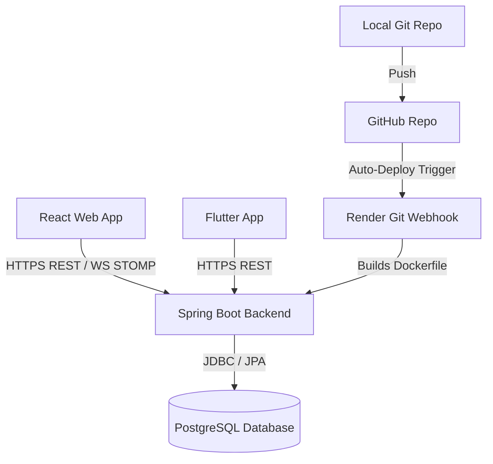

# System Integration, Deployment & Geolocation Guide

Welcome to the System Integration Guide of the **SUST Attendance System**. This document describes how all the parts (the Web client, Mobile client, Backend server, Git repository, Database, and Docker containers) connect and communicate, and the math/logic behind geofenced location calculations.

---

## 🗺️ 1. System Topology & Connections

The attendance system uses a client-server architecture:



### 🔌 Client-Server Connection
* **HTTP/REST**: The React web client (using browser `fetch`) and the Flutter mobile client (using Dart `http`) perform standard HTTP calls for authenticating, fetching active sessions, joining classes, and sending attendance coordinates.
  * Headers: Standard requests include `Authorization: Bearer <token>` to pass JWT credentials.
  * Timeout handling: The client has a high threshold timeout of **90 seconds** because Render's free tier spins down the server if it has been idle. When a user sends a request, the server might take 30–50 seconds to boot up. A high timeout avoids client failures during wakeup.
* **WebSockets / STOMP**: The React web client sets up a connection via the `/ws` endpoint using the **STOMP (Simple Text Oriented Messaging Protocol)** library over WebSockets.
  * On starting a session, the backend pushes tick updates to `/topic/sessions/{sessionId}/ticks`. The browser receives these ticks in real-time, refreshing the QR code dynamically.

### 🗄️ Database Connection
* **JDBC Driver**: Spring Boot uses the PostgreSQL JDBC driver to open connections to the database.
* **Properties Mapping**: In `src/main/resources/application.yml`, the database source URL is configured as:
  `jdbc:postgresql://${DB_HOST:localhost}:${DB_PORT:5432}/${DB_NAME:jarvis_att}`
  * Locally: It resolves to `localhost:5432` with username/password `jarvis`.
  * Production (Render): Render automatically binds the PostgreSQL container to the Web Service container, injecting variables like `DB_HOST`, `DB_PORT`, `DB_NAME`, `DB_USER`, and `DB_PASSWORD` directly into the environment. Spring Boot picks these up automatically.
* **Schema Control (Flyway)**: When the application starts, Flyway scans the `src/main/resources/db/migration` directory, compares the SQL scripts to the database history table, and executes new migrations (V1, V2, V3) sequentially.

### 🐙 Git Version Control & Deployment
* **Local Repo**: Code is versioned in a local git repository.
* **GitHub Link**: The repository is hosted on GitHub.
* **Auto-Deployment**: Render.com is linked to the GitHub repository. Whenever a developer pushes changes to the `main` branch, a webhook notifies Render. Render pulls the latest code, reads the `Dockerfile` at the root, builds the Docker image, and spins up the updated container.

---

## 📍 2. Geolocation & Geofencing Calculation

### A. How Coordinates are Obtained (Client Calibration)
* **Web**: Uses the HTML5 Geolocation API (`navigator.geolocation.getCurrentPosition`) with `{ enableHighAccuracy: true }`.
* **Mobile**: Uses the `geolocator` plugin in Flutter to pull hardware coordinates from the mobile OS.
* **Accuracy Calibration Loop**:
  Both clients run a loop **up to 6 times** with a **700ms delay** between checks:
  1. Pulls coordinates and records accuracy (in meters).
  2. If the current reading is more accurate (smaller error radius) than the best reading so far, it becomes the new "best".
  3. If the reading matches or is better than the desired accuracy threshold (like 20 meters), it breaks out of the loop early.
  4. Returns the best location. If the best accuracy is wider than the allowed radius, it throws an error warning the user to get a better GPS lock.

### B. Haversine Distance Formula
When a student claims attendance, the server calculates the distance between the teacher's starting GPS coordinate and the student's coordinate. It uses the **Haversine Formula**, which measures the shortest distance between two points on the surface of a sphere (representing Earth):

$$\Delta \text{lat} = \text{lat}_2 - \text{lat}_1$$
$$\Delta \text{lon} = \text{lon}_2 - \text{lon}_1$$
$$a = \sin^2\left(\frac{\Delta \text{lat}}{2}\right) + \cos(\text{lat}_1) \cdot \cos(\text{lat}_2) \cdot \sin^2\left(\frac{\Delta \text{lon}}{2}\right)$$
$$c = 2 \cdot \text{atan2}(\sqrt{a}, \sqrt{1-a})$$
$$\text{Distance} = R \cdot c$$

* Where $R = 6,371,000 \text{ meters}$ (the average radius of the Earth).
* In the Java backend, this is implemented in `AttendanceService.java` as:
  ```java
  public static double calculateHaversineDistance(double lat1, double lon1, double lat2, double lon2) {
      final double EARTH_RADIUS_METERS = 6371000.0;
      double dLat = Math.toRadians(lat2 - lat1);
      double dLon = Math.toRadians(lon2 - lon1);
      double a = Math.sin(dLat / 2) * Math.sin(dLat / 2)
              + Math.cos(Math.toRadians(lat1)) * Math.cos(Math.toRadians(lat2))
              * Math.sin(dLon / 2) * Math.sin(dLon / 2);
      double c = 2 * Math.atan2(Math.sqrt(a), Math.sqrt(1 - a));
      return EARTH_RADIUS_METERS * c;
  }
  ```

### C. Conservative Geofence Bound Check
To prevent fake GPS injection and verify the student is physically in the room, the backend performs a two-tier verification:

1. **Accuracy Threshold Check**:
   Ensures the student's GPS accuracy is suitable. If a student's GPS accuracy has an error margin greater than the geofence radius, their signal is too weak:
   $$\text{accuracyMeters} \le \text{radiusMeters}$$
2. **Error Margin Bound Check**:
   To prevent students outside the classroom from claiming attendance by luck or spoofing, the system performs a conservative check:
   $$\text{distanceMeters} + \text{accuracyMeters} \le \text{radiusMeters}$$
   * **Why?** If the distance is 15 meters and the accuracy error margin is $\pm 8$ meters, the student's true location could be anywhere from 7 meters to 23 meters away. Because 23 meters exceeds a 20-meter geofence, the check fails. The student must stand still to improve accuracy (reducing the error margin) or move closer to the center of the room.

---

## 🐳 3. Containerization & Docker Implementation

### A. Backend Container (`Dockerfile`)
* **Multi-Stage Build**: Separates compile-time dependencies from runtime requirements to keep the production image small and secure.
* **Stage 1 (Build)**:
  ```dockerfile
  FROM maven:3.9-eclipse-temurin-21 AS build
  WORKDIR /app
  COPY pom.xml .
  COPY .mvn .mvn
  RUN mvn -B dependency:go-offline
  COPY src src
  RUN mvn -B -DskipTests package
  ```
  * Uses a Maven image with JDK 21.
  * Copies dependency files and runs `dependency:go-offline` to cache dependencies (improving rebuild speed).
  * Copies source files and compiles them into a `.jar` package (`mvn package`).
* **Stage 2 (Runtime)**:
  ```dockerfile
  FROM eclipse-temurin:21-jre
  WORKDIR /app
  COPY --from=build /app/target/*.jar app.jar
  EXPOSE 8080
  ENTRYPOINT ["java", "-jar", "app.jar"]
  ```
  * Uses a lightweight Java Runtime Environment (JRE) image (no compiler tools, much smaller size).
  * Copies the compiled `.jar` file from Stage 1 into the new container.
  * Exposes port `8080` for web traffic.
  * Defines the entry command to start the Spring Boot app.

### B. Local Multi-Container Services (`docker-compose.yml`)
* **Purpose**: Orchestrates and links multiple container services together with a single command (`docker compose up -d`).
* **Structure**:
  * Spins up a database service based on the `postgres:16` image.
  * Binds the container's PostgreSQL port 5432 to the host machine's port 5432 so developers can connect using database clients.
  * Sets default environment credentials: user (`jarvis`), password (`jarvis`), and database name (`jarvis_att`).
  * Mounts a **named volume** (`jarvis-att-postgres`) mapping to `/var/lib/postgresql/data` inside the container. This ensures database tables and records are preserved even if the container is stopped, restarted, or deleted.
