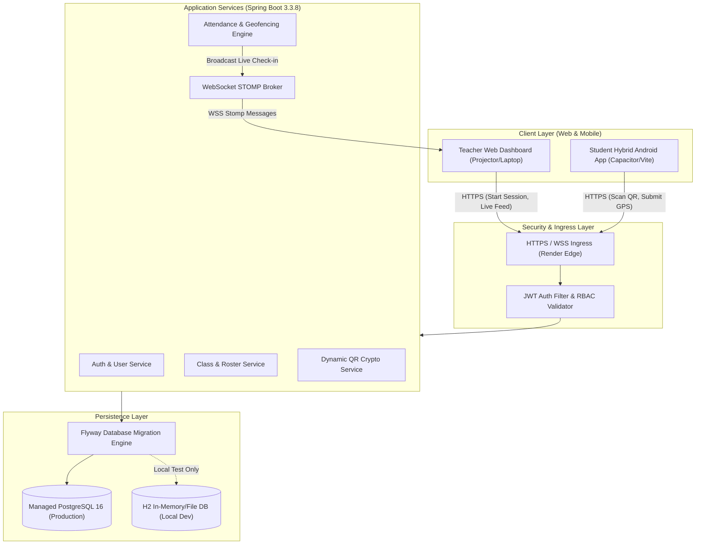
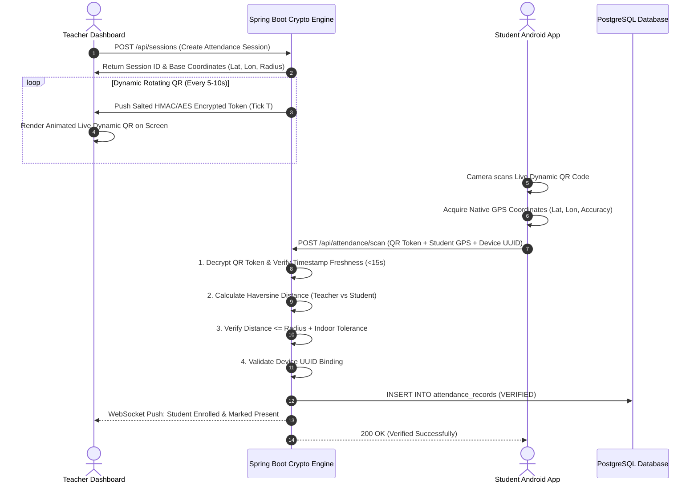
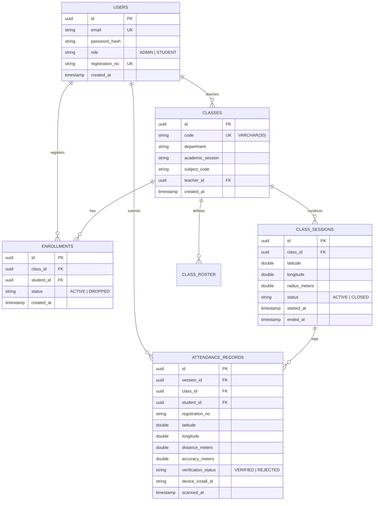

# JARVIS SWE-Attendance System
## Enterprise Technical Specification & System Architecture Documentation
*Standard Industry-Grade Engineering & Operational Documentation*

---

## 📑 Table of Contents
1. [Executive Summary & System Overview](#1-executive-summary--system-overview)
2. [High-Level System Architecture](#2-high-level-system-architecture)
3. [Security, Cryptography & Anti-Fraud Engine](#3-security-cryptography--anti-fraud-engine)
4. [Database Schema & Data Dictionary](#4-database-schema--data-dictionary)
5. [API Specification & Protocols](#5-api-specification--protocols)
6. [Frontend & Hybrid Mobile Architecture](#6-frontend--hybrid-mobile-architecture)
7. [DevOps, Deployment & Infrastructure](#7-devops-deployment--infrastructure)
8. [Engineering Runbook & Operations Guide](#8-engineering-runbook--operations-guide)
9. [Industry Guidelines for Engineering Documentation](#9-industry-guidelines-for-engineering-documentation)

---

## 1. Executive Summary & System Overview

### 1.1 Problem Statement
Traditional classroom attendance mechanisms (paper sheets, static QR codes, or basic biometric scanners) suffer from significant vulnerabilities:
- **Proxy Attendance**: Students share static QR code screenshots or credentials with remote peers.
- **Location Spoofing**: Students trigger check-ins from outside the lecture hall using fake GPS or remote VPN tunnels.
- **Administrative Friction**: Manual data reconciliation, roster imports, and lost records create heavy overhead for faculty.

### 1.2 System Solution
**JARVIS SWE-Attendance** is an enterprise-grade, cryptographically secure attendance system designed for university departments. It integrates **Dynamic Rotating QR Codes**, **Indoor Haversine Geofencing with GPS Calibration**, **Hardware Device Binding**, and **Real-Time WebSocket Feedback** into a cross-platform (Web + Android APK) solution.

### 1.3 Key Architectural Pillars
- **Zero Proxy QR Protocol**: QR codes rotate every 5–10 seconds using salted HMAC-SHA256 + AES encryption. Screenshots expire before they can be shared.
- **Indoor Geofencing Calibration**: Haversine distance validation factoring in real-world indoor satellite drift ($\pm 15\text{m}$ to $\pm 25\text{m}$).
- **Stateless Cloud Backend**: Spring Boot 3.3.8 micro-monolith connected to managed PostgreSQL 16 with zero data loss across container deployments.
- **Cross-Platform Native Shell**: React 18 + Vite hybrid client packaged via Capacitor for native Android deployment and responsive web browsers.

---

## 2. High-Level System Architecture



---

## 3. Security, Cryptography & Anti-Fraud Engine



### 3.1 Dynamic Rotating QR Algorithm
To prevent QR forwarding, the teacher screen rotates a token every $T$ seconds:
$$\text{Token}_T = \text{AES-256-GCM}\Big(\text{SessionID} \parallel \text{Timestamp}_T \parallel \text{HMAC-SHA256}(\text{SessionID} \parallel \text{Timestamp}_T, \text{SecretKey})\Big)$$
- **Expiration Window**: Tokens older than 15 seconds are rejected by `requireFreshCapture()`.
- **Replay Attack Defense**: Once a student submits with a given tick timestamp, subsequent scans with the same tick are rejected.

### 3.2 Indoor Geofencing & GPS Calibration Formula
Standard GPS indoors suffers from multi-path reflection off walls and concrete ceilings. The system applies the **Haversine Distance Equation** with an adaptive error margin:

$$d = 2R \arcsin\left(\sqrt{\sin^2\left(\frac{\Delta\phi}{2}\right) + \cos(\phi_1)\cos(\phi_2)\sin^2\left(\frac{\Delta\lambda}{2}\right)}\right)$$

$$\text{Allowed Threshold} = \text{ClassRadius} + \min(\text{GPS Accuracy}, 15.0\text{m})$$

- **Rejection Condition**: If GPS signal accuracy $> 80\text{m}$ (cell-tower fallback / degraded satellite visibility), the student is prompted to enable high-accuracy mode.
- **Verification Rule**: $d \le \text{Allowed Threshold}$.

---

## 4. Database Schema & Data Dictionary



### 4.1 Schema Migration History (Flyway)
| Version | Migration Script | Purpose |
| :--- | :--- | :--- |
| **V1** | `V1__init_schema.sql` | Core schema (`users`, `classes`, `class_sessions`, `attendance_records`, `devices`). |
| **V2** | `V2__gps_attendance.sql` | Added session coordinates, student GPS logging, and distance attributes. |
| **V3** | `V3__gps_accuracy_calibration.sql` | Added `accuracy_meters` and device installation fingerprinting columns. |
| **V4** | `V4__add_semester_and_credits.sql` | Extended class metadata with `semester` and `credits` tracking. |
| **V5** | `V5__alter_class_code_length.sql` | Expanded `classes.code` from `VARCHAR(6)` to `VARCHAR(30)` to eliminate multi-course collision. |

---

## 5. API Specification & Protocols

### 5.1 Authentication Module (`/api/auth`)
| Method | Endpoint | Access | Description |
| :--- | :--- | :--- | :--- |
| `POST` | `/api/auth/register` | Public | Register a new Teacher or Student account. |
| `POST` | `/api/auth/login` | Public | Authenticate credentials; returns JWT bearer token. |
| `POST` | `/api/auth/reset-password` | Public | Reset account password via registration number or email. |
| `DELETE` | `/api/auth/users/{target}` | Admin | Delete user account and cascade-remove associated records. |

### 5.2 Classroom Management (`/api/classes`)
| Method | Endpoint | Access | Description |
| :--- | :--- | :--- | :--- |
| `GET` | `/api/classes` | Authenticated | List all classes owned by teacher or joined by student. |
| `POST` | `/api/classes` | Teacher | Create a new class course (e.g. `SWE0613-1121`). |
| `GET` | `/api/classes/{id}` | Authenticated | Retrieve complete class details, roster count, and stats. |
| `POST` | `/api/classes/join` | Student | Join a class using its unique code. |
| `GET` | `/api/classes/{id}/students` | Teacher | List all actively enrolled students in the class. |

### 5.3 Live Attendance Session (`/api/sessions` & `/api/attendance`)
| Method | Endpoint | Access | Description |
| :--- | :--- | :--- | :--- |
| `POST` | `/api/sessions` | Teacher | Initialize a live attendance session with GPS geofence. |
| `GET` | `/api/sessions/{id}/live-qr` | Teacher | Fetch the current dynamic AES/HMAC QR code payload. |
| `POST` | `/api/attendance/scan` | Student | Submit scanned QR token + GPS payload for real-time verification. |
| `GET` | `/api/attendance/session/{id}` | Teacher | Retrieve all verified attendance records for a session. |
| `WS` | `/topic/attendance/{sessionId}` | Teacher | Real-time WebSocket channel broadcasting student check-ins. |

---

## 6. Frontend & Hybrid Mobile Architecture

### 6.1 Architecture Overview
- **Core Library**: React 18 with Vite build bundler.
- **Routing**: React Router with Role-Based Route Guards (`TeacherRoute`, `StudentRoute`).
- **Hybrid Bridge**: `@capacitor/core`, `@capacitor/geolocation`, `@capacitor/camera`, `@capacitor/device`.
- **Dynamic Styling**: Vanilla CSS Token System with Dark-Mode Aesthetic and Micro-Animations.

### 6.2 Mobile Build & Packaging Workflow
```powershell
# 1. Build React Web Application
npm --prefix frontend run build

# 2. Sync Web Assets to Native Android Platform
npx cap sync android

# 3. Open Android Studio or Build APK
npx cap open android
```

---

## 7. DevOps, Deployment & Infrastructure

### 7.1 Multi-Environment Setup
| Environment | Backend URL | Database Host | Storage Type |
| :--- | :--- | :--- | :--- |
| **Production** | `https://jarvis-att.onrender.com` | `dpg-d9fdtcrh523c73f1bgm0-a.oregon-postgres.render.com` | Persistent PostgreSQL 16 |
| **Local Dev** | `http://localhost:8080` | `localhost:5432` or `./data/jarvis_db` | H2 File Fallback |

### 7.2 Environment Variable Reference
```env
# Database Credentials
DB_HOST=dpg-d9fdtcrh523c73f1bgm0-a.oregon-postgres.render.com
DB_NAME=jarvis_att_db
DB_USER=jarvis_att_db_user
DB_PASSWORD=<managed-postgres-password>
DB_PORT=5432

# Security & Cryptography Secrets
JARVIS_AES_KEY=<32-byte-base64-encoded-key>
JARVIS_HMAC_SECRET=<32-byte-base64-encoded-secret>
JARVIS_JWT_SECRET=<64-byte-base64-encoded-secret>

# Server Configuration
PORT=8080
```

---

## 8. Engineering Runbook & Operations Guide

### 8.1 Connecting to Production Database (`psql`)
```powershell
& "C:\Program Files\PostgreSQL\18\bin\psql.exe" "postgresql://jarvis_att_db_user:<PASSWORD>@dpg-d9fdtcrh523c73f1bgm0-a.oregon-postgres.render.com/jarvis_att_db"
```

### 8.2 Standard Operational Queries
- **Inspect all registered users & roles**:
  ```sql
  SELECT email, role, registration_no, created_at FROM users ORDER BY created_at DESC;
  ```
- **Inspect active classes & teachers**:
  ```sql
  SELECT c.code, c.subject_code, u.email as teacher_email FROM classes c JOIN users u ON c.teacher_id = u.id;
  ```
- **Delete an unwanted user (Cascades all child data)**:
  ```sql
  DELETE FROM users WHERE email = 'target_user@example.com';
  ```

---

## 9. Industry Guidelines for Engineering Documentation

To maintain high technical standards across engineering teams, all system documentation must follow these industry practices:

### 9.1 The "Golden Rules" of Software Architecture Documentation
1. **Source of Truth**: Maintain documentation alongside code in git (`/docs` or `documentation.md`). Update docs in the same PR/commit as schema or API modifications.
2. **Visual Communication**: Use standard **C4 Model** and **Mermaid.js** diagrams for all flows, sequence validations, and database schemas.
3. **Reproducibility**: Include exact curl/HTTP requests, SQL migration versions, and command lines for operations.
4. **Failure Modes & Defenses**: Always document *why* a constraint exists (e.g., GPS drift tolerances, QR tick timeouts, token expirations).
5. **No Ambiguity**: Specify explicit types, constraints (`VARCHAR(30)` vs `TEXT`), units (meters, milliseconds), and security algorithms (AES-GCM, HMAC-SHA256).

---
*Documentation maintained by Engineering Team • SWE Department, SUST*
