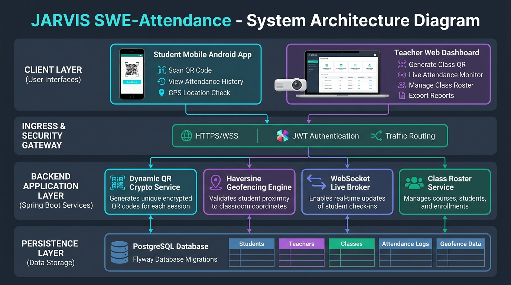
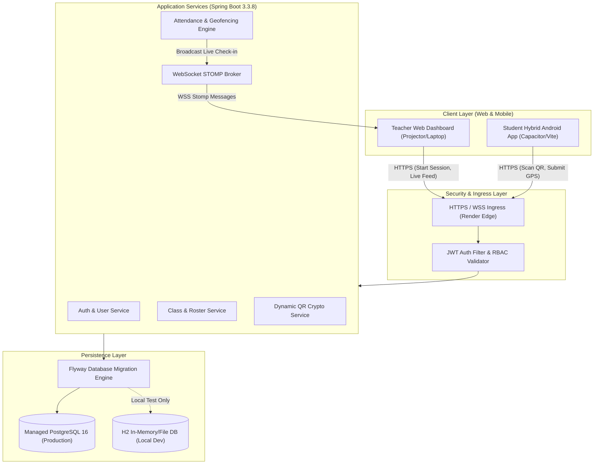
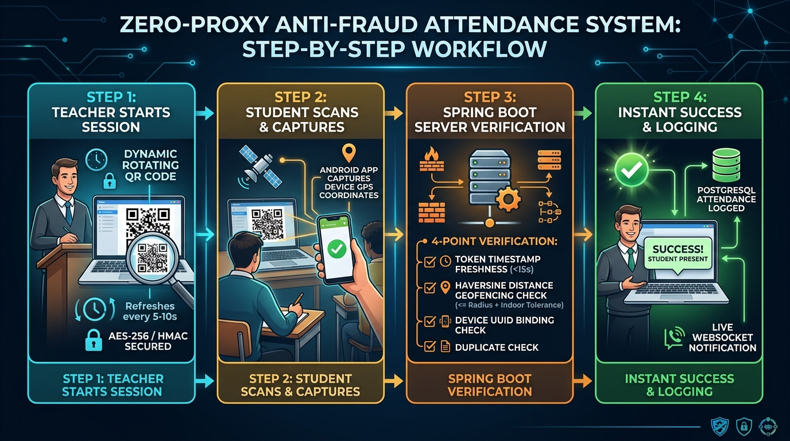
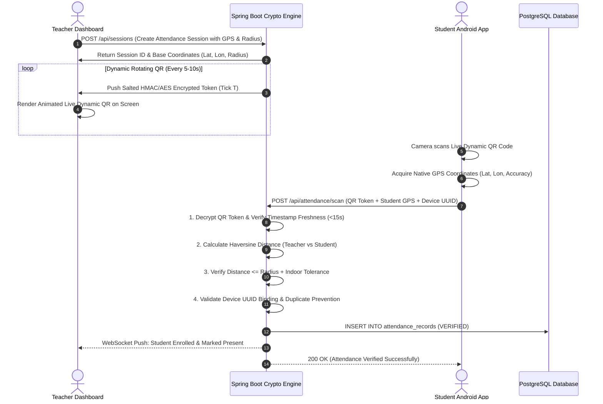
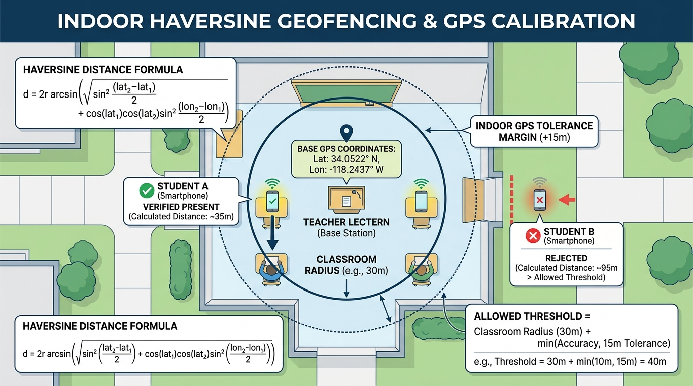
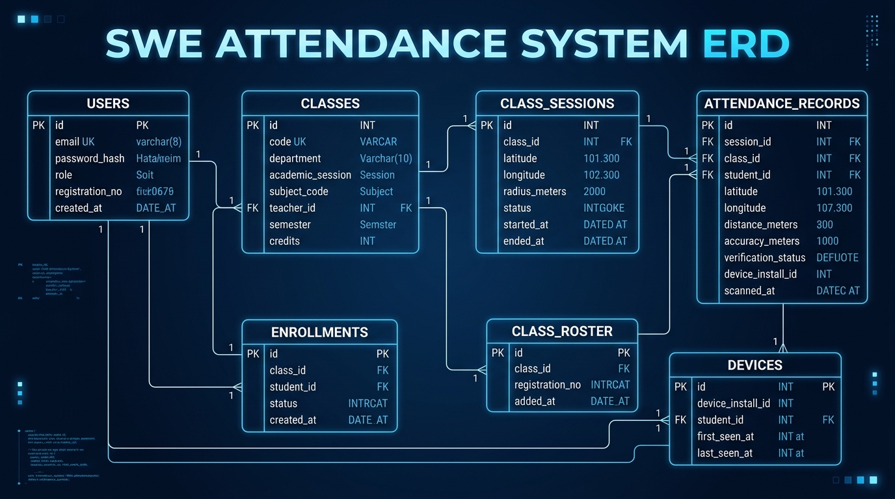
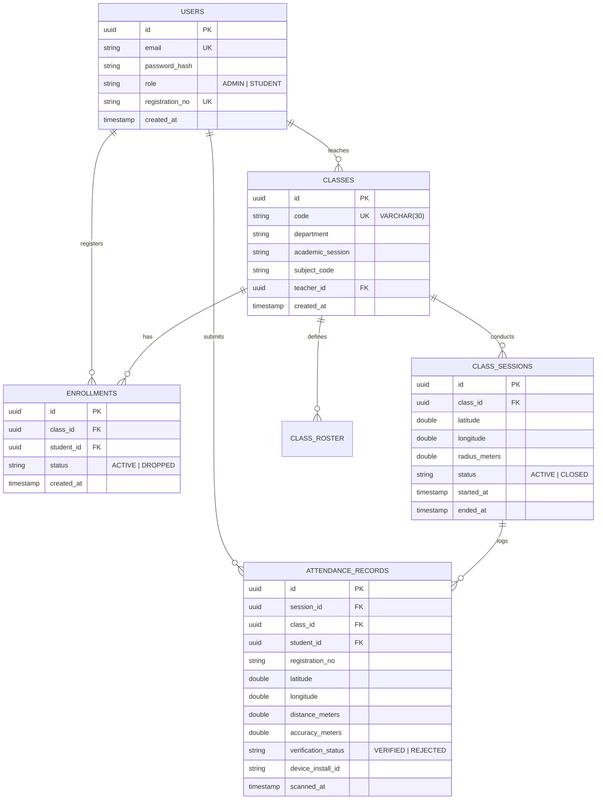

# JARVIS SWE-Attendance System
## Enterprise Technical Specification & Comprehensive Architecture Documentation
*Production-Ready Engineering Documentation for Sustainable Operations & Maintenance*

---

## 📑 Table of Contents
1. [Executive Summary & System Overview](#1-executive-summary--system-overview)
2. [High-Level System Architecture](#2-high-level-system-architecture)
3. [Security, Cryptography & Anti-Fraud Engine](#3-security-cryptography--anti-fraud-engine)
4. [Indoor Geofencing & GPS Calibration Engine](#4-indoor-geofencing--gps-calibration-engine)
5. [Database Schema & Data Dictionary](#5-database-schema--data-dictionary)
6. [API Specification & Protocols](#6-api-specification--protocols)
7. [Frontend & Hybrid Mobile Architecture](#7-frontend--hybrid-mobile-architecture)
8. [DevOps, Deployment & Infrastructure](#8-devops-deployment--infrastructure)
9. [Engineering Runbook & Operational Guide](#9-engineering-runbook--operational-guide)
10. [Industry Guidelines & Technical Standards](#10-industry-guidelines--technical-standards)

---

## 1. Executive Summary & System Overview

### 1.1 Problem Statement
Traditional classroom attendance mechanisms (paper signature sheets, static projection QR codes, or standard biometric sensors) introduce severe operational inefficiencies and security loopholes:
- **Proxy Attendance**: Students easily capture photo/screenshot copies of static QR codes or share login credentials with absent peers off-campus.
- **Location Spoofing**: Students trigger check-ins from outside the lecture hall using fake GPS mocking applications or remote VPN tunnels.
- **Administrative Overhead**: Manual roster updates, roll-call reconciliation, and fragmented spreadsheet logs consume significant instructional time and frequently lead to lost or disputed attendance records.

### 1.2 System Solution
**JARVIS SWE-Attendance** is an enterprise-grade, cryptographically hardened attendance system tailored for university departments and institutional lectures. It guarantees high-integrity physical presence verification by combining:
1. **Dynamic Rotating QR Codes** (salted HMAC-SHA256 + AES encryption rotating every 5–10 seconds).
2. **Indoor Haversine Geofencing with GPS Calibration** ($\pm 15\text{m}$ to $\pm 25\text{m}$ error calibration).
3. **Hardware & Installation Device Fingerprinting** (prevents multi-account swapping on a single phone).
4. **Real-Time WebSocket STOMP Feedback** (instant visual check-in confirmation on the instructor's projector).
5. **Cross-Platform Native Shell** (React 18 + Vite SPA paired with Capacitor Android native build).

### 1.3 Key Architectural Pillars
- **Zero-Proxy QR Protocol**: QR payloads rotate dynamically with sub-15s expiration windows, defeating screenshot sharing.
- **Indoor Geofence Tolerance**: Haversine distance model with adaptive error radius prevents false rejections inside concrete buildings.
- **Stateless Cloud Micro-Monolith**: Built with Spring Boot 3.3.8 (Java 21), decoupled services, and managed PostgreSQL 16 on Render.
- **Database Schema Evolution**: Automated zero-downtime database versioning managed via Flyway migrations.

---

## 2. High-Level System Architecture

### 2.1 Architectural Overview Diagram
The following architecture infographic illustrates the end-to-end data flow and interaction across system boundaries:



### 2.2 Layered System Topology


### 2.3 Subsystem Breakdown
1. **Client Layer**:
   - **Teacher Dashboard**: Single Page Application running on desktop or projector browser; manages courses, initiates live attendance sessions, and receives instant check-in notifications.
   - **Student Mobile Client**: Android application built with Capacitor; accesses native camera scanner and high-precision GPS sensors.
2. **Ingress & Security Layer**:
   - TLS 1.3 termination, CORS validation, rate-limiting, and stateless Spring Security JWT filter.
3. **Application Core (Spring Boot 3.3.8)**:
   - **Crypto Service**: Handles timestamped salted HMAC-SHA256 and AES-256-GCM token encryption and rotation.
   - **Geofencing Engine**: Computes spherical distance using the Haversine formula with calibrated accuracy bounds.
   - **WebSocket Broker**: Dispatches real-time STOMP events over `/topic/attendance/{sessionId}`.
4. **Data Persistence**:
   - Managed PostgreSQL 16 hosted on Render with Flyway automated schema migrations.

---

## 3. Security, Cryptography & Anti-Fraud Engine

### 3.1 Step-by-Step Attendance Verification Workflow
The following visual workflow breaks down how the anti-fraud protocol functions during an active lecture session:



### 3.2 Sequence Diagram


### 3.3 Dynamic Rotating QR Algorithm & Token Encryption
To prevent remote screenshots from being forwarded via messaging apps, the teacher dashboard requests a refreshed token every $T$ seconds (default $5\text{s}$):

$$\text{Token}_T = \text{AES-256-GCM}\Big(\text{SessionID} \parallel \text{Timestamp}_T \parallel \text{HMAC-SHA256}(\text{SessionID} \parallel \text{Timestamp}_T, \text{SecretKey})\Big)$$

- **Freshness Window**: Scans older than $15\text{ seconds}$ from generation time are rejected by `requireFreshCapture()`.
- **Replay Protection**: A deterministic session-tick hash ensures a single tick cannot be reused across duplicate requests.
- **Hardware Device Lock**: Each attendance request includes a unique `deviceInstallId`. A device cannot submit attendance for multiple different student accounts within the same session.

---

## 4. Indoor Geofencing & GPS Calibration Engine

### 4.1 Visual Geofencing Calibration Model
GPS satellite signals degrade inside concrete multi-story university buildings. JARVIS incorporates an adaptive tolerance model to balance security and convenience:



### 4.2 Haversine Mathematical Model
The great-circle spherical distance $d$ between the teacher's base station $(\phi_1, \lambda_1)$ and the student's device $(\phi_2, \lambda_2)$ is computed as:

$$\Delta\phi = \phi_2 - \phi_1, \quad \Delta\lambda = \lambda_2 - \lambda_1$$

$$a = \sin^2\left(\frac{\Delta\phi}{2}\right) + \cos(\phi_1)\cos(\phi_2)\sin^2\left(\frac{\Delta\lambda}{2}\right)$$

$$d = 2 R \cdot \arcsin\left(\sqrt{a}\right) \quad \text{where } R = 6{,}371{,}000\text{ meters}$$

### 4.3 Adaptive Threshold Formula
$$\text{Allowed Threshold} = \text{ClassRadius} + \min(\text{GPS Accuracy}, 15.0\text{m})$$

| Parameter | Default Value | Description |
| :--- | :--- | :--- |
| `ClassRadius` | $30\text{m} - 50\text{m}$ | Configured radius established when the teacher starts the session. |
| `GPS Accuracy` | Native Sensor Value | Horizontal accuracy reported by the mobile device hardware in meters. |
| `Indoor Tolerance Cap` | $15.0\text{m}$ | Maximum acceptable buffer for multi-path wall reflection and satellite drift. |
| `Hard Accuracy Limit` | $80.0\text{m}$ | Rejection threshold; if accuracy $> 80\text{m}$ (e.g. coarse cell-tower triangulation), the student must enable High-Accuracy GPS. |

---

## 5. Database Schema & Data Dictionary

### 5.1 Entity Relationship Diagram (ERD)
The database structure is designed for relational consistency, referential integrity, and high-performance querying:



### 5.2 Schema Relational Model


### 5.3 Flyway Database Migration History
| Migration File | Version | Key Changes & Schema Enhancements |
| :--- | :--- | :--- |
| `V1__init_schema.sql` | **V1** | Initial base tables (`users`, `classes`, `class_sessions`, `attendance_records`, `devices`). |
| `V2__gps_attendance.sql` | **V2** | Added geolocation fields (`latitude`, `longitude`, `radius_meters`) to sessions and attendance records. |
| `V3__gps_accuracy_calibration.sql` | **V3** | Added `accuracy_meters` and `device_install_id` for enhanced anti-fraud tracking. |
| `V4__add_semester_and_credits.sql` | **V4** | Extended `classes` table with `semester` and `credits` attributes for academic tracking. |
| `V5__alter_class_code_length.sql` | **V5** | Expanded `classes.code` length from `VARCHAR(6)` to `VARCHAR(30)` to eliminate multi-session collision. |

---

## 6. API Specification & Protocols

### 6.1 Authentication Module (`/api/auth`)
| Method | Endpoint | Access | Request Body / Params | Description |
| :--- | :--- | :--- | :--- | :--- |
| `POST` | `/api/auth/register` | Public | `{ email, password, role, registrationNo }` | Registers a new faculty or student account. |
| `POST` | `/api/auth/login` | Public | `{ email, password }` | Authenticates credentials and issues JWT Bearer token. |
| `POST` | `/api/auth/reset-password` | Public | `{ registrationNo, newPassword }` | Self-service password reset for students/teachers. |
| `DELETE` | `/api/auth/users/{target}` | Admin / Faculty | `Path: target (email or reg_no)` | Removes user account and cascade-cleans associated data. |

### 6.2 Classroom & Roster Management (`/api/classes`)
| Method | Endpoint | Access | Description |
| :--- | :--- | :--- | :--- |
| `GET` | `/api/classes` | Authenticated | Lists all classes owned by teacher or joined by student. |
| `POST` | `/api/classes` | Teacher | Creates a new class offering (e.g. `SWE0613-1121`). |
| `GET` | `/api/classes/{id}` | Authenticated | Retrieves detailed class metrics, statistics, and roster count. |
| `POST` | `/api/classes/join` | Student | Enrolls a student into a course using its unique class code. |
| `GET` | `/api/classes/{id}/students` | Teacher | Retrieves full student roster with individual attendance percentages. |

### 6.3 Live Attendance Sessions (`/api/sessions` & `/api/attendance`)
| Method | Endpoint | Access | Description |
| :--- | :--- | :--- | :--- |
| `POST` | `/api/sessions` | Teacher | Starts a live attendance session with teacher GPS and geofence radius. |
| `GET` | `/api/sessions/{id}/live-qr` | Teacher | Fetches the active dynamic rotating AES/HMAC QR code payload. |
| `POST` | `/api/attendance/scan` | Student | Submits scanned QR token, student GPS coordinates, and device UUID. |
| `GET` | `/api/attendance/session/{id}` | Teacher | Retrieves list of all verified student check-ins for the session. |
| `WS` | `/topic/attendance/{sessionId}` | Teacher | Real-time STOMP WebSocket channel broadcasting check-in events. |

---

## 7. Frontend & Hybrid Mobile Architecture

### 7.1 Tech Stack & UI Components
- **Framework**: React 18 with Vite for optimized bundle footprint.
- **Routing**: React Router 6 with Role-Based Route Guards (`TeacherRoute`, `StudentRoute`).
- **Capacitor Hybrid Plugins**:
  - `@capacitor/camera`: Direct access to hardware camera for fast dynamic QR frame capture.
  - `@capacitor/geolocation`: High-accuracy satellite geolocation with fallback sensor handlers.
  - `@capacitor/device`: Secure installation UUID generation for device binding.
- **Design System**: Vanilla CSS token architecture with dark-mode aesthetic, micro-animations, and responsive glassmorphism.

### 7.2 Native Android Compilation & Build Steps
```powershell
# Step 1: Install frontend dependencies
npm --prefix frontend install

# Step 2: Build production Vite SPA bundle
npm --prefix frontend run build

# Step 3: Synchronize web assets with native Android platform
npx cap sync android

# Step 4: Open Android Studio to build signed APK
npx cap open android
```

---

## 8. DevOps, Deployment & Infrastructure

### 8.1 Multi-Environment Deployment Setup
| Environment | Backend Service URL | Database Endpoint | Persistence Type |
| :--- | :--- | :--- | :--- |
| **Production** | `https://jarvis-att.onrender.com` | `dpg-d9fdtcrh523c73f1bgm0-a.oregon-postgres.render.com` | Managed PostgreSQL 16 |
| **Staging / CI** | Render Ephemeral Preview | Render Managed PostgreSQL Test Instance | Ephemeral PostgreSQL |
| **Local Dev** | `http://localhost:8080` | `localhost:5432` or `./data/jarvis_db` | H2 File Fallback |

### 8.2 Production Environment Variables (`.env`)
```env
# Database Credentials
DB_HOST=dpg-d9fdtcrh523c73f1bgm0-a.oregon-postgres.render.com
DB_PORT=5432
DB_NAME=jarvis_att_db
DB_USER=jarvis_att_db_user
DB_PASSWORD=<managed-postgres-password>

# Cryptographic Keys & Secrets
JARVIS_AES_KEY=<32-byte-base64-encoded-key>
JARVIS_HMAC_SECRET=<32-byte-base64-encoded-secret>
JARVIS_JWT_SECRET=<64-byte-base64-encoded-secret>

# Application Server Port
PORT=8080
```

---

## 9. Engineering Runbook & Operational Guide

### 9.1 Connecting to Production Database (`psql`)
```powershell
& "C:\Program Files\PostgreSQL\18\bin\psql.exe" "postgresql://jarvis_att_db_user:<PASSWORD>@dpg-d9fdtcrh523c73f1bgm0-a.oregon-postgres.render.com/jarvis_att_db"
```

### 9.2 Useful Operational & Maintenance SQL Queries
- **List all users and registered roles**:
  ```sql
  SELECT email, role, registration_no, created_at FROM users ORDER BY created_at DESC;
  ```
- **Inspect active classes with instructor details**:
  ```sql
  SELECT c.code, c.subject_code, c.department, u.email AS teacher_email 
  FROM classes c 
  JOIN users u ON c.teacher_id = u.id;
  ```
- **Inspect attendance records for a specific session**:
  ```sql
  SELECT a.registration_no, a.distance_meters, a.accuracy_meters, a.verification_status, a.scanned_at 
  FROM attendance_records a 
  WHERE a.session_id = 'SESSION_UUID_HERE' 
  ORDER BY a.scanned_at ASC;
  ```
- **Safely delete an account (cascades all enrollments and records)**:
  ```sql
  DELETE FROM users WHERE email = 'target_user@example.com';
  ```

---

## 10. Industry Guidelines & Technical Standards

To maintain high technical standards across engineering teams, all system documentation must follow these industry practices:

1. **Source of Truth**: Maintain documentation alongside code in Git (`/docs` or `finalDoc.md`). Update docs in the same PR/commit as schema or API modifications.
2. **Visual Communication**: Use clear visual infographics and **Mermaid.js** diagrams for all flows, sequence validations, and database schemas so any team member can immediately grasp system behavior.
3. **Reproducibility**: Include exact curl/HTTP requests, SQL migration versions, and command lines for operations.
4. **Failure Modes & Defenses**: Always document *why* a constraint exists (e.g., GPS drift tolerances, QR tick timeouts, token expirations).
5. **No Ambiguity**: Specify explicit types, constraints (`VARCHAR(30)` vs `TEXT`), units (meters, milliseconds), and security algorithms (AES-GCM, HMAC-SHA256).

---
*Documentation maintained by Engineering Team • SWE Department, SUST*
